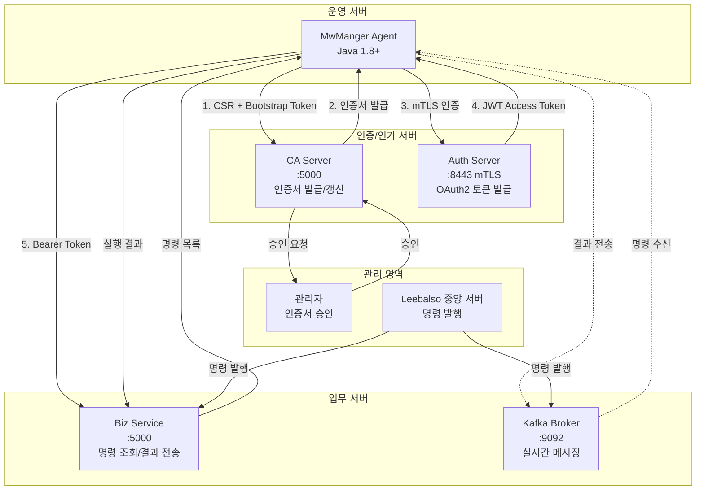
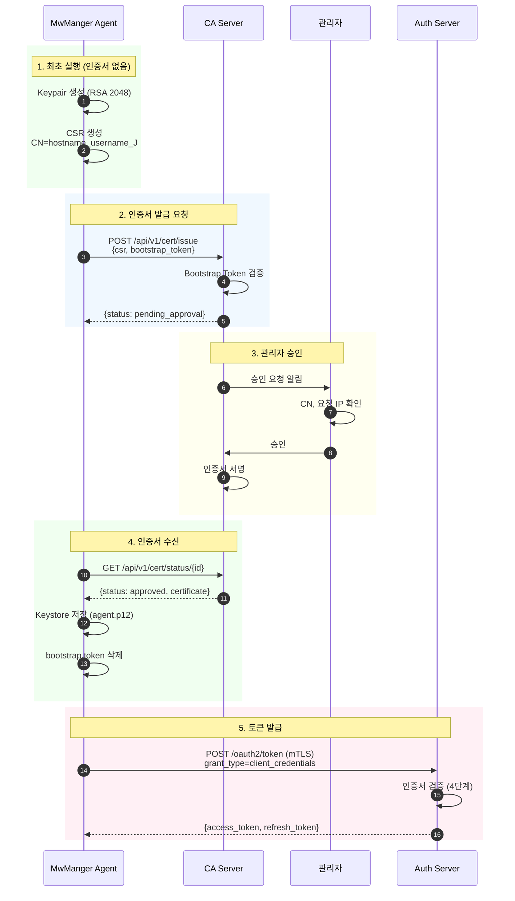
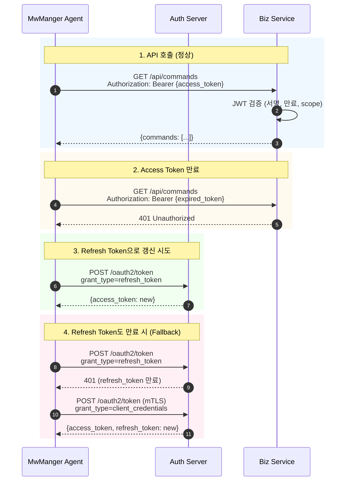
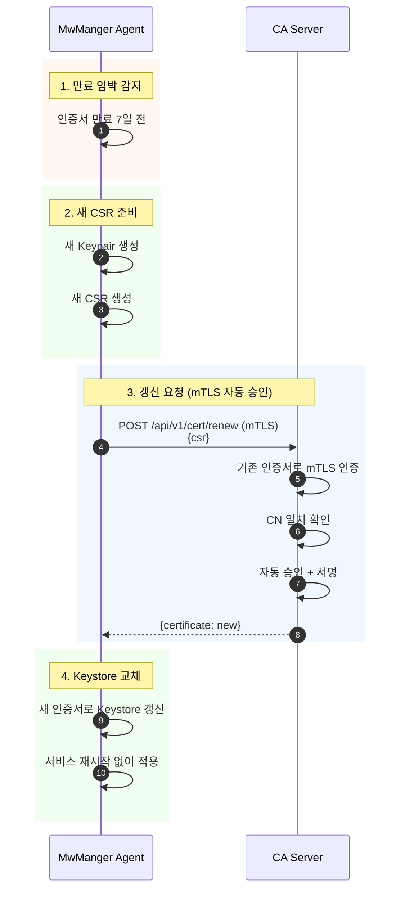

# MwManger Agent 리팩토링 프로젝트 보고서

**프로젝트명**: MwManger Agent 리팩토링
**기간**: 2025년 11월 ~ 12월
**버전**: 0000.0009.0010
**브랜치**: refactoring_major_202511
**작성일**: 2025-12-18

---

## 목차

1. [목적 및 배경](#1-목적-및-배경)
2. [수행 내용](#2-수행-내용)
3. [시사점, Lessons Learned, 향후 계획](#3-시사점-lessons-learned-향후-계획)

---

## 1. 목적 및 배경

### 1.1 프로젝트 개요

MwManger는 Leebalso 프로젝트의 에이전트 프로그램으로, 각 서버에서 데몬으로 실행되면서 중앙 서버로부터 명령을 수신하여 수행하는 Java 기반 원격 관리 에이전트입니다.

### 1.2 리팩토링 배경

#### 기존 시스템의 문제점

| 영역 | 문제점 | 위험도 |
|------|--------|--------|
| **보안** | Command Injection 취약점 (Runtime.exec 직접 사용) | CRITICAL |
| **보안** | Path Traversal 취약점 (경로 검증 없음) | CRITICAL |
| **보안** | 토큰이 로그에 평문으로 노출 | HIGH |
| **보안** | 단순 Refresh Token 기반 인증 (탈취 시 무한 사용 가능) | HIGH |
| **아키텍처** | Config 싱글톤에 강하게 결합 (테스트 불가) | MEDIUM |
| **아키텍처** | 하나의 클래스에 여러 책임 집중 (PreWork.java 150줄) | MEDIUM |
| **코드 품질** | 매직 넘버 사용 (-1, -2 등의 상태 코드) | LOW |
| **코드 품질** | 동시성 버그 (논리 연산자 오류) | HIGH |

#### 리팩토링의 특수성

본 프로젝트는 **운영 중인 레거시 시스템의 리팩토링**이라는 특수성을 가집니다:

1. **기존 기능 유지 필수**: 리팩토링 중에도 기존 Agent가 정상 동작해야 함
2. **점진적 전환**: Big-bang 방식이 아닌 Phase별 단계적 전환
3. **하위 호환성**: mTLS와 Legacy 인증 방식 모두 지원 필요
4. **다중 플랫폼**: Windows, Linux, AIX, HP-UX 모두 지원

### 1.3 AI Coding 협업을 위한 설계

본 프로젝트는 **AI(Claude) 협업 개발**을 염두에 두고 설계되었습니다:

```
┌─────────────────────────────────────────────────────────────┐
│                AI Coding 친화적 설계 원칙                     │
├─────────────────────────────────────────────────────────────┤
│  1. Test-Driven Development (TDD)                           │
│     - 모든 기능에 테스트 코드 선행                            │
│     - AI가 테스트를 기준으로 코드 수정 가능                   │
│                                                             │
│  2. SOLID 원칙 준수                                          │
│     - Single Responsibility: 클래스당 하나의 책임            │
│     - Interface Segregation: 작은 인터페이스 분리            │
│     - Dependency Inversion: 추상화에 의존                    │
│                                                             │
│  3. Phase 분할                                               │
│     - 각 Phase는 독립적으로 완료 가능                         │
│     - AI가 한 번에 처리할 수 있는 작업 단위                   │
│                                                             │
│  4. 명확한 문서화                                            │
│     - CLAUDE.md: AI를 위한 프로젝트 컨텍스트                  │
│     - REFACTORING_PLAN.md: 전체 계획 및 진행 상황            │
│     - WORK_HISTORY.md: 작업 이력 추적                        │
└─────────────────────────────────────────────────────────────┘
```

**AI Coding이 순조롭도록 한 핵심 요소**:

| 요소 | 적용 방법 | 효과 |
|------|----------|------|
| **Test-Driven** | 215개 테스트로 동작 검증 | AI가 수정 후 즉시 검증 가능 |
| **SOLID 원칙** | 인터페이스 추상화 (ConfigurationProvider, HttpClient) | AI가 구현체 교체 용이 |
| **Microservice화** | Service Layer 분리 (KafkaService, CommandExecutorService) | 독립적 수정 가능 |
| **Phase 분할** | 6개 Phase로 분리 (보안 → 아키텍처 → 품질) | 작업 범위 명확화 |
| **문서화** | CLAUDE.md에 핵심 규칙 기술 | AI가 컨텍스트 빠르게 파악 |

---

## 2. 수행 내용

### 2.1 Phase별 진행 현황

```
Phase 1  ████████████████████ 100%  Lifecycle Management
Phase 2  ████████████████████ 100%  Security Hardening
Phase 3  ████████████████████ 100%  Dependency Injection
Phase 4  ████████████████████ 100%  mTLS Test Environment
Phase 5  ████████████████████ 100%  Integration Testing
Phase 6  ████████████████████ 100%  Code Quality
```

### 2.2 Phase 1: Lifecycle Management (2025-11-21)

**목표**: 체계적인 생명주기 관리 프레임워크 구축

#### 구현 내용

```
┌─────────────────────────────────────────────────────────────┐
│              AgentLifecycleManager                          │
│  ┌──────────┐  ┌──────────┐  ┌────────────────┐            │
│  │Bootstrap │→ │   Init   │→ │   Runtime      │            │
│  │(등록/승인)│  │(Kafka 등) │  │(명령 처리)     │            │
│  └──────────┘  └──────────┘  └────────────────┘            │
└─────────────────────────────────────────────────────────────┘
                          ↓
┌─────────────────────────────────────────────────────────────┐
│  GracefulShutdownHandler                                    │
│  - Service shutdown (LIFO)                                  │
│  - Resource cleanup                                         │
│  - Log flush (30초 timeout)                                 │
└─────────────────────────────────────────────────────────────┘
```

**새로운 컴포넌트**:

| 파일 | 역할 |
|------|------|
| `AgentLifecycle.java` | Lifecycle 인터페이스 정의 |
| `LifecycleState.java` | 상태 enum (CREATED → RUNNING → STOPPED) |
| `AgentLifecycleManager.java` | 전체 생명주기 관리 |
| `GracefulShutdownHandler.java` | 안전한 종료 처리 |
| `KafkaService.java` | Kafka 통신 통합 관리 |
| `CommandExecutorService.java` | ThreadPool 기반 명령 실행 |

**성과**:
- 106개 테스트 통과 (22개 신규)
- Graceful shutdown 구현으로 데이터 유실 방지
- 상태 기반 아키텍처로 전환

### 2.3 Phase 2: Security Hardening (2025-12-02)

**목표**: Critical 보안 취약점 해결

#### 보안 취약점 수정 현황

| 취약점 | Before | After | 상태 |
|--------|--------|-------|------|
| Command Injection | `Runtime.exec(command)` 직접 사용 | `SecurityValidator` 검증 + ProcessBuilder | ✅ |
| Path Traversal | 경로 검증 없음 | `../` 패턴 차단, Canonical path 검증 | ✅ |
| Token Logging | `logger.fine("token: " + token)` | 끝 10자리만 마스킹 표시 | ✅ |
| 동시성 버그 | `\|\| stopRequested==true` | `&& !stopRequested` | ✅ |

#### SecurityValidator 구현

```java
public class SecurityValidator {
    // Command Injection 방어
    private static final Pattern DANGEROUS_CHARS =
        Pattern.compile("[;|`$()&<>\\n\\r]");

    // Path Traversal 방어
    private static final Pattern PATH_TRAVERSAL =
        Pattern.compile("\\.\\.[\\\\/]");

    public static boolean containsPathTraversal(String path);
    public static boolean containsDangerousCharacters(String input);
    public static String maskToken(String token);  // 끝 10자리만 표시
}
```

**보안 설정 옵션화** (agent.properties):
```properties
security.path_traversal_check=true   # 기본값: ON
security.command_injection_check=false # 기본값: OFF (특수문자 차단)
```

**성과**:
- 155개 테스트 통과 (33개 보안 테스트 추가)
- OWASP Top 10 취약점 대응 완료

### 2.4 Phase 3: Dependency Injection (2025-12-03)

**목표**: 테스트 가능한 아키텍처로 전환

#### DI 아키텍처

```
┌─────────────────────────────────────────────────────────────┐
│                    ApplicationContext                        │
│                    (DI Container)                            │
├─────────────────────────────────────────────────────────────┤
│  ┌─────────────────┐    ┌──────────────────────────────┐   │
│  │ Configuration   │    │        HttpClient            │   │
│  │   Provider      │    │        (Interface)           │   │
│  │   (Interface)   │    └──────────────────────────────┘   │
│  └─────────────────┘               ↑                       │
│          ↑                         │                       │
│          │                ┌────────┴─────────┐             │
│  ┌───────┴───────┐       │                  │             │
│  │               │       │                  │             │
│  │  Config.java  │       │ ApacheHttp       │ MockHttp    │
│  │ (Production)  │       │ ClientAdapter    │ Client      │
│  │               │       │ (Production)     │ (Test)      │
│  └───────────────┘       └──────────────────┴─────────────┘
└─────────────────────────────────────────────────────────────┘
```

**새로운 인터페이스**:

| 인터페이스 | 구현체 | 용도 |
|-----------|--------|------|
| `ConfigurationProvider` | `Config.java` | 설정 추상화 |
| `HttpClient` | `ApacheHttpClientAdapter` | HTTP 통신 추상화 |

**성과**:
- 187개 테스트 통과
- Mock 주입으로 단위 테스트 용이성 대폭 향상
- 순환 의존성 제거

### 2.5 Phase 4: mTLS 인증 체계 구축 (2025-12-03)

**목표**: 인증서 기반 상호 인증(mTLS) 환경 구축

#### 인증 체계 개선

**Before (취약)**:
```
Agent ──[Refresh Token]──> Server
        (탈취 시 무한 사용 가능)
```

**After (강화)**:
```
┌─────────────────┐     ┌─────────────────┐     ┌─────────────────┐
│    CA Server    │     │   Auth Server   │     │   Biz Service   │
│  (인증서 발급)   │     │  (토큰 발급)     │     │  (업무 서비스)   │
└────────┬────────┘     └────────┬────────┘     └────────┬────────┘
         │                       │                       │
         │ 인증서 발급            │ mTLS + JWT            │ JWT 검증
         ▼                       ▼                       ▼
┌─────────────────────────────────────────────────────────────────┐
│                        MwManger Agent                           │
│  - mTLS 클라이언트 인증서로 Auth Server에 인증                    │
│  - JWT Access Token으로 Biz Service API 호출                     │
└─────────────────────────────────────────────────────────────────┘
```

#### mTLS + OAuth2 통합

| 구분 | 프로토콜 | 용도 |
|------|----------|------|
| **Authentication** | mTLS (RFC 8705) | 클라이언트 인증서로 신원 증명 |
| **Authorization** | OAuth2 (RFC 6749) | JWT Access Token으로 권한 관리 |

#### 인증서 Subject DN 형식

```
CN={hostname}_{username}_J, OU=agent, O=Leebalso, C=KR
```

| 필드 | 예시 값 | JWT Claim 매핑 |
|------|---------|---------------|
| CN | testserver01_appuser_J | `sub` (Agent ID) |
| CN 파싱 | testserver01 | `hostname` |
| CN 파싱 | appuser | `username` |
| OU | agent | `usertype` |

#### 계단식 토큰 갱신 (Cascading Token Renewal)

```
access_token 만료 (401 응답)
        ↓
1. refresh_token grant 시도 (/oauth2/token)
        ↓
   성공 → 새 access_token 사용
        ↓ (실패 - 401: refresh_token 만료)
2. mTLS client_credentials grant 시도
        ↓
   성공 → 새 access_token 사용
        ↓ (실패)
   에러 로그 및 재시도
```

**4단계 검증 프로세스**:
1. OU 검증: usertype이 "agent"인지 확인
2. 등록 확인: Agent가 DB에 등록되고 활성 상태인지
3. 정보 일치: 인증서의 hostname/username이 등록 정보와 일치
4. IP 검증: 클라이언트 IP가 허용 목록에 있는지 (인증서 복사 방지)

**성과**:
- 테스트 인증서 생성 자동화 (generate-certs.sh/bat)
- Python Mock OAuth2 서버 구현 (mock_server.py)
- mTLS + IP + Username 검증 로직 완성

### 2.6 Phase 5: Integration Testing (2025-12-04)

**목표**: E2E 테스트 환경 구축

#### 테스트 서버 구성

```
┌──────────────────────────────────────────────────────────────┐
│                     Test Environment                          │
├──────────────────────────────────────────────────────────────┤
│                                                              │
│  ┌─────────────────┐    ┌─────────────────┐                 │
│  │   CA Server     │    │  Mock Auth      │                 │
│  │   (Python)      │    │  Server         │                 │
│  │   :5000         │    │  :8443 (mTLS)   │                 │
│  └─────────────────┘    └─────────────────┘                 │
│                                                              │
│  ┌─────────────────┐    ┌─────────────────┐                 │
│  │   Biz Service   │    │   Java Agent    │                 │
│  │   (Flask+JWT)   │    │   (Test)        │                 │
│  │   :5000         │    │                 │                 │
│  └─────────────────┘    └─────────────────┘                 │
│                                                              │
└──────────────────────────────────────────────────────────────┘
```

#### 구현된 테스트 서버

| 서버 | 위치 | 용도 |
|------|------|------|
| Mock Auth Server | `test-server/mock_server.py` | OAuth2 토큰 발급, mTLS 검증 |
| CA Server | `ca-server/app.py` | 인증서 발급/갱신 |
| Biz Service | `biz-service/app.py` | JWT 토큰 검증 예제 |

#### 통합 테스트 현황

| 테스트 클래스 | 테스트 수 | 검증 내용 |
|--------------|----------|----------|
| `BizServiceIntegrationTest` | 10개 | Auth → Biz Service 토큰 흐름 |
| `MtlsTokenRenewalIntegrationTest` | 8개 | mTLS 토큰 갱신 시나리오 |
| `SSLCertiFuncTest` | 9개 | SSL 인증서 정보 조회 |
| `SSLCertiFileFuncTest` | 6개 | 인증서 파일 파싱 |

**성과**:
- 200+ 테스트 통과
- E2E 흐름 검증 완료
- 기술 문서 작성 (mTLS-JWT-Authentication-Flow.md)

### 2.7 Phase 6: Code Quality (2025-12-05)

**목표**: 코드 품질 개선 및 유지보수성 향상

#### 완료 항목

| 항목 | 내용 |
|------|------|
| **버전 관리 단일화** | `Version.java`가 유일한 버전 소스 |
| **Naming Convention** | `PreWork` → `AgentRegistrationPhase` 등 |
| **Dead Code 제거** | 주석 처리된 코드, 미사용 import 정리 |
| **Magic Number 제거** | 상수화 (`SHUTDOWN_TIMEOUT_MS = 30000`) |
| **Error Code 표준화** | `AgentErrorCode` enum 도입 |

**최종 테스트 결과**:
```
Total Tests: 215
✓ Success:   215 (100%)
✗ Failures:  0
✗ Errors:    0
```

### 2.8 프로젝트 구조 변화

#### Before (리팩토링 전)

```
mwmanger/
├── MwAgent.java          # 모든 로직 집중
├── PreWork.java          # 150줄, 복잡한 등록 로직
├── common/
│   ├── Config.java       # 싱글톤, 테스트 불가
│   └── Common.java       # 보안 취약점 존재
└── order/
    └── ExeShell.java     # Command Injection 취약
```

#### After (리팩토링 후)

```
mwmanger/
├── MwAgent.java                    # 진입점만 담당
├── lifecycle/                      # ★ Phase 1
│   ├── AgentLifecycle.java
│   ├── LifecycleState.java
│   ├── AgentLifecycleManager.java
│   └── GracefulShutdownHandler.java
├── service/                        # ★ Phase 1
│   ├── KafkaService.java
│   ├── CommandExecutorService.java
│   └── registration/
│       ├── BootstrapService.java
│       ├── RegistrationService.java
│       └── AgentStatusService.java
├── infrastructure/                 # ★ Phase 3
│   ├── config/
│   │   └── ConfigurationProvider.java
│   └── http/
│       ├── HttpClient.java
│       └── ApacheHttpClientAdapter.java
├── application/
│   └── ApplicationContext.java     # DI Container
├── common/
│   ├── Config.java                 # ConfigurationProvider 구현
│   ├── Common.java                 # mTLS 지원
│   ├── Version.java                # 버전 단일 소스
│   └── SecurityValidator.java      # ★ Phase 2
└── vo/
    ├── AgentStatus.java            # Type-safe enum
    ├── RegistrationRequest.java
    └── RegistrationResponse.java
```

### 2.9 현재 형상 기준 서비스 구성도

#### 시스템 아키텍처



#### 컴포넌트 상세

| 컴포넌트 | 포트 | 프로토콜 | 역할 |
|---------|------|----------|------|
| **CA Server** | 5000 | HTTPS | 인증서 발급, 갱신, 폐기 |
| **Auth Server** | 8443 | mTLS | OAuth2 토큰 발급 (client_credentials, refresh_token) |
| **Biz Service** | 5000 | HTTPS + JWT | 명령 조회, 결과 수신, 에이전트 설정 |
| **Kafka** | 9092 | SASL/SSL | 실시간 명령 Push, 결과 수집 |
| **MwManger Agent** | - | Client | 명령 실행, 결과 전송 |

### 2.10 서비스 인증 흐름도

#### 최초 등록 흐름 (Bootstrap)



#### 일반 운영 흐름 (토큰 갱신)



#### 인증서 갱신 흐름 (자동)



---

## 3. 시사점, Lessons Learned, 향후 계획

### 3.1 시사점

#### 보안 강화의 중요성

```
┌─────────────────────────────────────────────────────────────┐
│                    보안 강화 Before/After                     │
├───────────────────────┬─────────────────────────────────────┤
│        Before         │              After                   │
├───────────────────────┼─────────────────────────────────────┤
│ Refresh Token 단독    │ mTLS + OAuth2 이중 인증              │
│ (탈취 시 무한 사용)    │ (인증서 + IP + Username 검증)        │
├───────────────────────┼─────────────────────────────────────┤
│ Runtime.exec() 직접   │ SecurityValidator 검증               │
│ (Command Injection)   │ + ProcessBuilder 사용                │
├───────────────────────┼─────────────────────────────────────┤
│ 경로 검증 없음        │ Canonical Path 검증                  │
│ (Path Traversal)      │ + 허용 디렉토리 제한                  │
├───────────────────────┼─────────────────────────────────────┤
│ 토큰 평문 로깅        │ 마스킹 처리 (끝 10자리만)             │
└───────────────────────┴─────────────────────────────────────┘
```

#### Phase 분할의 효과

| Phase | 테스트 수 | 누적 | 증분 |
|-------|----------|------|------|
| Phase 1 | 106 | 106 | +106 |
| Phase 1.5 | 127 | 127 | +21 |
| Phase 2 | 155 | 155 | +28 |
| Phase 3 | 187 | 187 | +32 |
| Phase 5 | 212 | 212 | +25 |
| Phase 6 | 215 | 215 | +3 |

**Phase 분할의 장점**:
1. **위험 분산**: 각 Phase가 독립적으로 롤백 가능
2. **검증 용이**: Phase별 테스트로 점진적 검증
3. **AI 협업 최적화**: Claude가 한 번에 처리 가능한 작업 단위

### 3.2 Lessons Learned

#### 성공 요인

| 요인 | 설명 |
|------|------|
| **Test-First 접근** | 모든 변경에 테스트 선행 → 회귀 버그 조기 발견 |
| **인터페이스 추상화** | DI 도입으로 Mock 테스트 가능 → 테스트 커버리지 향상 |
| **문서화 강화** | CLAUDE.md, REFACTORING_PLAN.md → AI가 컨텍스트 빠르게 파악 |
| **하위 호환성 유지** | mTLS/Legacy 모드 병행 → 운영 중 점진적 전환 가능 |

#### 개선이 필요했던 점

| 항목 | 발생 상황 | 해결 방법 |
|------|----------|----------|
| **Gradle 빌드 실패** | 프록시/SSL 환경에서 의존성 다운로드 불가 | Maven + 오프라인 빌드로 전환 |
| **테스트 환경 복잡성** | 여러 서버 실행 필요 | 환경변수 기반 조건부 테스트 |
| **인증서 관리** | 개발/테스트 인증서 관리 어려움 | generate-certs 스크립트 자동화 |

#### AI(Claude) 협업 시 효과적이었던 점

```
┌─────────────────────────────────────────────────────────────┐
│               AI 협업 Best Practices                         │
├─────────────────────────────────────────────────────────────┤
│                                                             │
│  1. CLAUDE.md 활용                                          │
│     - 프로젝트의 핵심 규칙을 간결하게 정리                    │
│     - AI가 매번 같은 컨텍스트를 빠르게 파악                   │
│                                                             │
│  2. 테스트 기반 개발                                         │
│     - AI가 수정 후 mvn test로 즉시 검증                      │
│     - 회귀 버그 자동 감지                                    │
│                                                             │
│  3. 작은 단위 작업                                           │
│     - Phase/Task를 작은 단위로 분할                          │
│     - AI가 한 번에 완료 가능한 범위로 요청                    │
│                                                             │
│  4. 명확한 인터페이스 정의                                    │
│     - 추상화된 인터페이스로 구현체 교체 용이                  │
│     - AI가 테스트용 Mock 쉽게 생성                           │
│                                                             │
└─────────────────────────────────────────────────────────────┘
```

### 3.3 향후 계획

#### 단기 계획 (1-2개월)

| 항목 | 설명 | 우선순위 |
|------|------|----------|
| **CA Server 운영화** | 테스트용 → 운영용 CA Server 구축 | HIGH |
| **인증서 자동 갱신** | 만료 7일 전 자동 갱신 구현 | HIGH |
| **모니터링 강화** | 토큰 만료, 인증 실패 메트릭 수집 | MEDIUM |

#### 중기 계획 (3-6개월)

| 항목 | 설명 |
|------|------|
| **Legacy 인증 제거** | mTLS 전환 완료 후 Refresh Token 단독 인증 제거 |
| **테스트 커버리지 80%** | 현재 70% → 80% 달성 |
| **CI/CD 파이프라인** | GitHub Actions 기반 자동 빌드/테스트/배포 |

---

## 부록

### A. 주요 파일 목록

| 파일 | 용도 |
|------|------|
| `CLAUDE.md` | AI를 위한 프로젝트 컨텍스트 |
| `REFACTORING_PLAN.md` | 전체 리팩토링 계획 |
| `WORK_HISTORY.md` | 작업 이력 |
| `TESTING.md` | 테스트 가이드 |
| `docs/mTLS-JWT-Authentication-Flow.md` | 인증 흐름 문서 |
| `docs/Token-Validation-Architecture.md` | 토큰 검증 아키텍처 |

### B. 빌드 및 테스트 명령어

```bash
# 전체 테스트 실행 (모든 통합 테스트 포함)
MTLS_INTEGRATION_TEST=true \
BIZ_SERVICE_INTEGRATION_TEST=true \
SSL_CERT_INTEGRATION_TEST=true \
HTTP_PROXY=http://70.10.15.10:8080 \
HTTPS_PROXY=http://70.10.15.10:8080 \
./tools/apache-maven-3.9.6/bin/mvn test

# 오프라인 빌드 (Windows)
/c/Windows/System32/cmd.exe //c "cd /d C:\GitHub\mwmanger && build-offline.bat"

# 결과물: build/mwmanger.jar
```

### C. 테스트 서버 실행

```bash
# 1. 인증서 생성
cd test-server && generate-certs.bat

# 2. Mock Auth Server (mTLS)
python mock_server.py --ssl   # https://localhost:8443

# 3. Biz Service (JWT 검증)
cd biz-service && python app.py   # http://localhost:5000

# 4. CA Server
cd ca-server && python app.py   # http://localhost:5000
```

---

**작성자**: 리팩토링 프로젝트 팀
**최종 수정일**: 2025-12-18
**버전**: 0000.0009.0010
