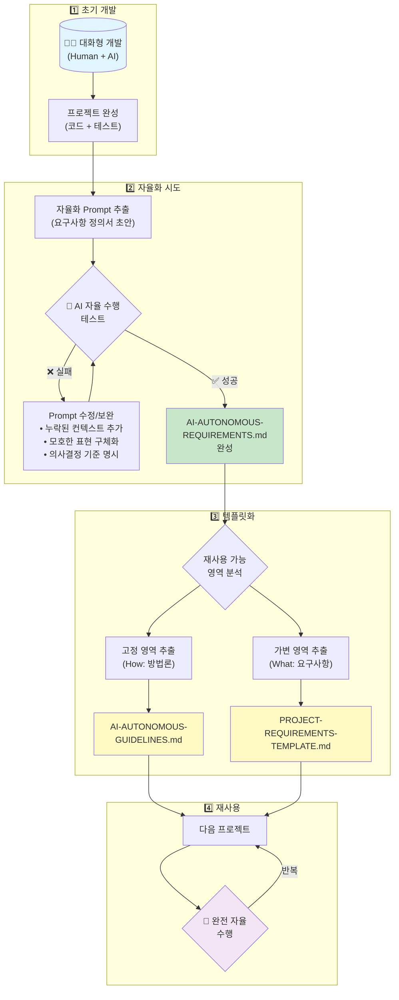

# AI 자율형 소프트웨어 개발: MwManger 프로젝트 사례 연구

## 소프트웨어 공학 기술 보고서

---

## 요약 (Abstract)

본 보고서는 대규모 언어 모델(LLM) 기반 AI 에이전트를 활용하여 레거시 시스템 리팩토링을 **완전 자율형**으로 수행한 사례를 다룬다. Claude Code CLI 도구를 사용하여 초기에는 대화형(Interactive)으로 프로젝트를 진행하였으나, 반복적인 실험과 프롬프트 엔지니어링을 통해 인간의 개입 없이 AI가 독립적으로 개발 전 과정을 수행할 수 있는 **요구사항 정의서(Prompt Template)** 체계를 구축하였다. 이를 통해 향후 유사 프로젝트에서 재사용 가능한 템플릿 기반 자율 개발 프레임워크를 제시한다.

**키워드**: AI 에이전트, 자율형 소프트웨어 개발, 프롬프트 엔지니어링, 레거시 리팩토링, Claude Code

---

## 1. 서론

### 1.1 연구 배경

소프트웨어 개발 패러다임은 GitHub Copilot(2021)의 등장 이후 급격히 변화하고 있다. 초기의 코드 자동완성(Code Completion) 수준에서 시작하여, 현재는 AI가 전체 개발 프로세스를 자율적으로 수행하는 **Agentic Coding** 단계로 진화하고 있다.

```
┌─────────────────────────────────────────────────────────────────────┐
│                    AI 코딩 도구의 진화 단계                          │
├─────────────────────────────────────────────────────────────────────┤
│                                                                     │
│  [1세대]          [2세대]           [3세대]          [4세대]         │
│  Code            Chat-based        Agentic          Autonomous      │
│  Completion      Coding            Coding           Development     │
│                                                                     │
│  • Copilot       • Cursor          • Claude Code    • 본 연구       │
│  • TabNine       • ChatGPT+IDE     • Devin          • (MwManger)    │
│                                                                     │
│  자동완성 →      대화형 코딩 →      에이전트 실행 →   완전 자율화      │
│                                                                     │
└─────────────────────────────────────────────────────────────────────┘
```

### 1.2 연구 목적

본 연구의 목적은 다음과 같다:

1. **실증적 검증**: AI가 인간의 개입 없이 소프트웨어 프로젝트를 완수할 수 있는지 검증
2. **방법론 개발**: 자율형 AI 개발을 위한 요구사항 정의 방법론 수립
3. **재사용성 확보**: 향후 프로젝트에 적용 가능한 템플릿 체계 구축

### 1.3 연구 범위

- **대상 시스템**: MwManger (Java 1.8 기반 원격 서버 관리 에이전트)
- **개발 도구**: Claude Code (Anthropic)
- **작업 유형**: 레거시 시스템 리팩토링 + 신규 기능 추가

---

## 2. 이론적 배경

### 2.1 Agentic AI의 정의

**Agentic AI**란 사용자의 목표를 이해하고, 스스로 계획을 수립하며, 도구(Tool)를 활용하여 자율적으로 작업을 수행하는 AI 시스템을 의미한다.

| 특성 | 기존 AI 어시스턴트 | Agentic AI |
|------|-------------------|------------|
| 작업 범위 | 단일 요청-응답 | 다단계 복합 작업 |
| 계획 수립 | 사용자가 명시 | AI가 자율 수립 |
| 도구 사용 | 제한적 | 파일 시스템, 터미널, Git 등 |
| 실행 주체 | 사용자 | AI 에이전트 |
| 오류 처리 | 사용자 개입 필요 | 자체 디버깅 시도 |

### 2.2 프롬프트 엔지니어링

프롬프트 엔지니어링(Prompt Engineering)은 AI 모델이 원하는 출력을 생성하도록 입력(프롬프트)을 설계하는 기법이다. 자율형 AI 개발에서는 단순한 지시문이 아닌, **완전한 컨텍스트**를 제공해야 한다.

```
┌─────────────────────────────────────────────────────────────────────┐
│                    효과적인 프롬프트의 구성 요소                      │
├─────────────────────────────────────────────────────────────────────┤
│                                                                     │
│  ┌──────────────┐   ┌──────────────┐   ┌──────────────┐            │
│  │   Context    │ + │    Rules     │ + │   Examples   │            │
│  │  (맥락 정보)  │   │  (규칙/제약)  │   │  (예시/패턴)  │            │
│  └──────────────┘   └──────────────┘   └──────────────┘            │
│         │                  │                  │                     │
│         ▼                  ▼                  ▼                     │
│  • 프로젝트 구조      • 기술 제약         • 코드 스타일              │
│  • 기존 코드베이스    • 보안 요구사항     • API 형식                 │
│  • 설정 파일 형식     • 호환성 조건       • 테스트 패턴              │
│                                                                     │
└─────────────────────────────────────────────────────────────────────┘
```

### 2.3 소프트웨어 리팩토링

리팩토링(Refactoring)은 외부 동작을 유지하면서 코드의 내부 구조를 개선하는 작업이다. Martin Fowler의 정의에 따르면, "소프트웨어의 관찰 가능한 동작을 변경하지 않으면서 내부 구조를 변경"하는 것이다.

본 프로젝트에서 수행한 리팩토링 유형:
- **보안 강화**: Command Injection, Path Traversal 방어
- **아키텍처 개선**: 의존성 주입(DI), 서비스 레이어 분리
- **테스트 가능성**: 인터페이스 추상화, Mock 객체 지원

### 2.4 Prompt Distillation (프롬프트 증류)

**Prompt Distillation**은 본 연구에서 제안하는 핵심 방법론으로, 대화형 AI 개발 과정에서 축적된 컨텍스트와 의사결정을 **자율 수행 가능한 프롬프트로 정제**하는 과정을 의미한다.

```
┌─────────────────────────────────────────────────────────────────────┐
│                    Prompt Distillation 프로세스                      │
├─────────────────────────────────────────────────────────────────────┤
│                                                                     │
│   [1단계]              [2단계]              [3단계]                  │
│   대화형 개발    →     패턴 추출      →     프롬프트 증류             │
│                                                                     │
│   • Human-AI 협업      • 반복 작업 식별     • 컨텍스트 문서화         │
│   • 시행착오 경험      • 의사결정 패턴      • 규칙/제약 명시          │
│   • 암묵지 축적        • 성공 조건 파악     • 자율 수행 가능 형태     │
│                                                                     │
│   ──────────────────────────────────────────────────────────────    │
│                                                                     │
│   Input: 대화 히스토리, 코드 변경 이력, 오류 해결 경험                │
│   Output: AI-AUTONOMOUS-REQUIREMENTS.md (자율 수행용 프롬프트)       │
│                                                                     │
└─────────────────────────────────────────────────────────────────────┘
```

기존 프롬프트 엔지니어링이 **사전에 프롬프트를 설계**하는 접근이라면, Prompt Distillation은 **실제 프로젝트 수행 후 사후적으로 프롬프트를 추출**하는 귀납적 접근이다.

| 구분 | 프롬프트 엔지니어링 | Prompt Distillation |
|------|-------------------|---------------------|
| **시점** | 사전 설계 (선험적) | 사후 추출 (귀납적) |
| **입력** | 요구사항, 도메인 지식 | 대화 히스토리, 실행 결과 |
| **방식** | Top-down | Bottom-up |
| **장점** | 체계적 설계 | 실증적 검증, 암묵지 포착 |
| **적용** | 신규 프로젝트 | 반복적 유지보수 프로젝트 |

---

## 3. 프로젝트 개요

### 3.1 MwManger 시스템 소개

MwManger는 원격 서버를 관리하는 **데몬 프로세스** 형태의 Java 에이전트이다. 중앙 서버로부터 명령을 수신하여 로컬 시스템에서 실행하고 결과를 보고한다.

```
┌─────────────────────────────────────────────────────────────────────┐
│                      MwManger 시스템 아키텍처                        │
├─────────────────────────────────────────────────────────────────────┤
│                                                                     │
│    ┌─────────────┐         ┌─────────────┐         ┌─────────────┐ │
│    │   Central   │◄───────►│  MwManger   │◄───────►│   Target    │ │
│    │   Server    │  REST   │   Agent     │  Local  │   System    │ │
│    │             │   API   │   (Java)    │  Exec   │             │ │
│    └─────────────┘         └─────────────┘         └─────────────┘ │
│           │                       │                                 │
│           ▼                       ▼                                 │
│    • 명령 배포              • 명령 수신/실행                         │
│    • 결과 수집              • 결과 보고                              │
│    • 인증 관리              • 토큰 갱신                              │
│                                                                     │
└─────────────────────────────────────────────────────────────────────┘
```

### 3.2 리팩토링 요구사항

| 영역 | As-Is (기존) | To-Be (목표) |
|------|-------------|-------------|
| 인증 | Refresh Token 방식 | mTLS + OAuth2 이원화 |
| 보안 | 입력 검증 없음 | Command Injection/Path Traversal 방어 |
| 구조 | 단일 클래스 집중 | 서비스 레이어 분리, DI 패턴 |
| 테스트 | 테스트 부재 | 200개 이상 단위 테스트 |
| 생명주기 | 즉시 종료 | Graceful Shutdown |

### 3.3 개발 방법론: Phase 기반 점진적 개발

전체 프로젝트를 9개의 Phase로 분할하여 점진적으로 수행하였다.

```
┌─────────────────────────────────────────────────────────────────────┐
│                         Phase별 개발 흐름                           │
├─────────────────────────────────────────────────────────────────────┤
│                                                                     │
│  Phase 0    Phase 1    Phase 2    Phase 3    Phase 4                │
│  ───────    ───────    ───────    ───────    ───────                │
│  Legacy     Gradle     생명주기    서비스     보안                   │
│  Initial    Setup      관리       레이어     검증                   │
│     │          │          │          │          │                   │
│     └──────────┴──────────┴──────────┴──────────┘                   │
│                          │                                          │
│  Phase 5    Phase 6    Phase 7    Phase 8    Phase 9                │
│  ───────    ───────    ───────    ───────    ───────                │
│  DI         테스트     mTLS       통합       문서화                  │
│  아키텍처    서버       OAuth2     테스트                            │
│     │          │          │          │          │                   │
│     └──────────┴──────────┴──────────┴──────────┘                   │
│                                                                     │
│  각 Phase: 브랜치 생성 → 구현 → 테스트 → 커밋 → Push                 │
│                                                                     │
└─────────────────────────────────────────────────────────────────────┘
```

---

## 4. 연구 방법: 대화형에서 자율형으로

### 4.0 전체 프로세스 개요

본 연구의 핵심 방법론은 **대화형 개발에서 시작하여 완전 자율형 개발로 진화**하는 과정이다. 아래 그림은 이 전체 프로세스를 4단계로 요약한 것이다.



**[그림 1] 자율화 프롬프트 개발 프로세스**

| 단계 | 핵심 활동 | 산출물 |
|------|----------|--------|
| 1단계 | 대화형으로 첫 프로젝트 완성 | 동작하는 코드 + 테스트 |
| 2단계 | 자율화 Prompt 추출 → 실패/수정 반복 | `AI-AUTONOMOUS-REQUIREMENTS.md` |
| 3단계 | 고정(How) / 가변(What) 분리 | 2개 템플릿 파일 |
| 4단계 | 다음 프로젝트에서 재사용 | 완전 자율 개발 실현 |

특히 **2단계의 Iteration Loop**가 본 연구의 핵심 기여이다. AI가 자율 수행에 실패할 때마다 누락된 컨텍스트, 모호한 표현, 의사결정 기준을 보완하면서 프롬프트를 정교화해 나가는 과정을 통해 최종적으로 완전 자율화가 가능한 요구사항 정의서를 도출하였다.

### 4.1 1단계: 대화형 개발 (Interactive Development)

초기에는 Claude Code CLI를 대화형 모드로 사용하여 개발자와 AI가 협업하였다.

```bash
# 대화형 모드 실행
$ claude

# 개발자-AI 대화 예시
Human: Phase 1을 시작해줘. Gradle 설정부터 하자.
Claude: 네, Phase 1을 시작하겠습니다. 먼저 현재 디렉토리 구조를 확인하겠습니다...
Human: build.gradle에 JUnit 5 의존성도 추가해줘.
Claude: JUnit 5 의존성을 추가하겠습니다...
```

**대화형 모드의 특징**:
- 개발자가 각 단계를 지시
- 중간 결과를 검토하고 피드백
- 오류 발생 시 즉시 수정 요청

### 4.2 2단계: 반자율형 개발 (Semi-Autonomous)

프로젝트 진행 중 패턴이 발견되었고, 이를 문서화하여 AI에게 더 많은 자율성을 부여하였다.

```bash
# 반자율형 모드 - 상세 지시 제공
$ claude "Phase 4를 수행해. 보안 검증 모듈을 구현하고, 
         Command Injection과 Path Traversal 방어 테스트를 작성해.
         테스트 통과 후 커밋해."
```

### 4.3 3단계: 완전 자율형 개발 (Fully Autonomous)

최종적으로 **요구사항 정의서** 하나만으로 AI가 전체 프로젝트를 자율 수행할 수 있게 되었다.

```bash
# 완전 자율형 모드 - 요구사항 문서만 제공
$ claude --dangerously-skip-permissions \
    "AI-AUTONOMOUS-REQUIREMENTS.md 문서를 읽고 
     요구사항에 따라 자율적으로 수행해."
```

**자율형 개발의 전제조건**:
1. 모든 컨텍스트가 문서에 포함
2. 의사결정 기준이 명시
3. 성공/실패 판단 기준이 명확
4. 예외 상황 처리 방법이 정의

---

## 5. 요구사항 정의서 설계

### 5.1 요구사항 정의서의 구조

AI가 자율적으로 프로젝트를 수행하기 위해서는 **완전한 컨텍스트**를 제공해야 한다. 본 연구에서 개발한 요구사항 정의서는 다음과 같은 구조를 갖는다.

```
┌─────────────────────────────────────────────────────────────────────┐
│                   AI 자율 수행용 요구사항 정의서 구조                  │
├─────────────────────────────────────────────────────────────────────┤
│                                                                     │
│  ┌─────────────────────────────────────────────────────────────┐   │
│  │ 0. 전제 조건 (Prerequisites)                                 │   │
│  │    • 입력: 레거시 소스코드 위치                               │   │
│  │    • AI 자율 수행 항목 명시                                   │   │
│  │    • 소스 위치, 설정 형식, API 스펙 (구조는 AI가 분석)        │   │
│  └─────────────────────────────────────────────────────────────┘   │
│                              │                                      │
│                              ▼                                      │
│  ┌─────────────────────────────────────────────────────────────┐   │
│  │ 1-4. 요구사항 (Requirements)                                 │   │
│  │    • 기능 요구사항 (FR)                                       │   │
│  │    • 비기능 요구사항 (NFR)                                    │   │
│  │    • 제약 조건                                                │   │
│  └─────────────────────────────────────────────────────────────┘   │
│                              │                                      │
│                              ▼                                      │
│  ┌─────────────────────────────────────────────────────────────┐   │
│  │ 5-8. 설계/산출물 (Design & Deliverables)                     │   │
│  │    • 설계 원칙 (SOLID, TDD)                                   │   │
│  │    • 산출물 정의 (소스, 테스트, 서버, 문서)                    │   │
│  │    • 성공 기준                                                │   │
│  └─────────────────────────────────────────────────────────────┘   │
│                              │                                      │
│                              ▼                                      │
│  ┌─────────────────────────────────────────────────────────────┐   │
│  │ 9. Phase별 작업 순서 (Execution Plan)                        │   │
│  │    • Phase 작업 흐름 (브랜치 → 구현 → 테스트 → 커밋)          │   │
│  │    • 완료 조건                                                │   │
│  │    • 실패 시 처리 방법                                        │   │
│  └─────────────────────────────────────────────────────────────┘   │
│                              │                                      │
│                              ▼                                      │
│  ┌─────────────────────────────────────────────────────────────┐   │
│  │ 10. 의사결정 가이드 (Decision Guide)                         │   │
│  │    • 명명 규칙, 예외 처리, 테스트 범위                        │   │
│  │    • 모호한 상황에서의 판단 기준                              │   │
│  └─────────────────────────────────────────────────────────────┘   │
│                                                                     │
└─────────────────────────────────────────────────────────────────────┘
```

### 5.2 핵심 설계 원칙

#### 원칙 1: 완전성 (Completeness)

AI가 추가 질문 없이 작업을 수행할 수 있도록 모든 정보를 포함한다.

```markdown
# 좋은 예: 완전한 정보 제공
## 기존 설정 파일 형식 (agent.properties)
```properties
server_url=https://server.example.com
get_command_uri=/api/v1/command/getCommands
token=REFRESH_TOKEN_VALUE
```

# 나쁜 예: 불완전한 정보
## 설정 파일
설정 파일은 properties 형식을 사용한다.
```

#### 원칙 2: 명확성 (Clarity)

모호한 표현을 피하고, 구체적인 수치와 조건을 명시한다.

```markdown
# 좋은 예: 명확한 기준
| 기준 | 측정 방법 |
|------|----------|
| 테스트 통과 | `./gradlew test` 실행 시 200개 이상 테스트 100% 통과 |
| 종료 대기 | 최대 30초 |

# 나쁜 예: 모호한 기준
- 충분한 테스트를 작성한다
- 적절한 시간 동안 대기한다
```

#### 원칙 3: 절차성 (Procedural)

작업 순서와 흐름을 명확히 정의한다.

```markdown
## Phase 작업 흐름 (모든 Phase 공통)
1. 브랜치 생성 (git checkout -b phaseN-xxx)
2. Coding (기능 구현)
3. Test Code 작성 (단위 테스트)
4. Test 실행 및 통과 확인 (./gradlew test)
5. Test 결과 보고
6. Git Commit
7. 브랜치 Push
8. 다음 Phase 진행
```

#### 원칙 4: 예외 처리 (Exception Handling)

실패 상황에서의 행동을 정의한다.

```markdown
## Phase 실패 시
테스트 실패 시:
1. 실패 원인 분석
2. 코드 수정
3. 테스트 재실행
4. 통과할 때까지 반복 (다음 Phase 진행 금지)
```

### 5.3 AI 자율 분석 영역

소스 구조와 보안 취약점 위치는 AI가 작업 시작 시 **자율적으로 분석**한다. 요구사항 정의서에는 분석 대상 패턴만 명시한다.

```markdown
# 요구사항 정의서 예시
**참고 - 분석 대상 취약점 패턴:**
- Command Injection: `Runtime.exec()` 직접 호출, 파라미터 미검증
- Path Traversal: `../` 패턴 미검증, 경로 검증 없음
- Token Logging: 토큰 평문 로깅
```

AI는 이 패턴을 기반으로 소스코드를 분석하여 취약점 위치를 스스로 파악한다.

---

## 6. 템플릿 분리 전략

### 6.1 문제 인식

초기 요구사항 정의서는 단일 문서로 작성되었으나, 향후 유지보수 프로젝트에서 반복 작성이 필요했다. 이에 **재사용 가능한 부분**과 **프로젝트별 가변 부분**을 분리하는 전략을 수립하였다.

### 6.2 템플릿 구조

```
┌─────────────────────────────────────────────────────────────────────┐
│                        템플릿 분리 구조                              │
├─────────────────────────────────────────────────────────────────────┤
│                                                                     │
│  ┌─────────────────────────────────────────────────────────────┐   │
│  │        AI-AUTONOMOUS-GUIDELINES.md (고정 템플릿)             │   │
│  │        ─────────────────────────────────────────            │   │
│  │        • 프로젝트 정보 (언어, 빌드 도구)                      │   │
│  │        • 소스 위치                                           │   │
│  │        • 설정 파일 형식                                      │   │
│  │        • API 스펙                                            │   │
│  │        • 빌드/테스트 명령어                                   │   │
│  │        • 핵심 규칙                                           │   │
│  │        • 설계 원칙                                           │   │
│  │        • Git 브랜치 전략                                     │   │
│  │        • Phase 작업 흐름                                     │   │
│  │        • 의사결정 가이드                                      │   │
│  └─────────────────────────────────────────────────────────────┘   │
│                              +                                      │
│  ┌─────────────────────────────────────────────────────────────┐   │
│  │      PROJECT-REQUIREMENTS.md (사용자 입력 템플릿)            │   │
│  │      ─────────────────────────────────────────              │   │
│  │        • 프로젝트 개요                                       │   │
│  │        • 비즈니스 목표                                       │   │
│  │        • 기능 요구사항 (FR)                                   │   │
│  │        • 비기능 요구사항 (NFR)                                │   │
│  │        • 제약 조건                                           │   │
│  │        • 산출물 정의                                         │   │
│  │        • 성공 기준                                           │   │
│  │        • Phase 정의                                          │   │
│  │        • 프로젝트 특화 의사결정                               │   │
│  └─────────────────────────────────────────────────────────────┘   │
│                              ↓                                      │
│  ┌─────────────────────────────────────────────────────────────┐   │
│  │                    AI 자율 수행 가능                          │   │
│  └─────────────────────────────────────────────────────────────┘   │
│                                                                     │
└─────────────────────────────────────────────────────────────────────┘
```

### 6.3 분리 기준

| 구분 | 고정 템플릿 | 사용자 입력 템플릿 |
|------|-----------|------------------|
| **변경 빈도** | 거의 변경 없음 | 프로젝트마다 변경 |
| **내용 성격** | How (방법) | What (무엇을) |
| **예시** | Git 브랜치 전략, 빌드 명령어 | 기능 요구사항, 산출물 |
| **재사용성** | 모든 MwManger 프로젝트에 적용 | 해당 프로젝트에만 적용 |

### 6.4 사용 방법

```bash
# 1. 고정 템플릿은 프로젝트 루트에 항상 존재
ls
# AI-AUTONOMOUS-GUIDELINES.md  (고정)

# 2. 사용자가 프로젝트별 요구사항 작성
cp PROJECT-REQUIREMENTS-TEMPLATE.md MY-PROJECT-REQUIREMENTS.md
vim MY-PROJECT-REQUIREMENTS.md  # 요구사항 작성

# 3. AI에게 두 문서 함께 제공
claude --dangerously-skip-permissions \
    "MY-PROJECT-REQUIREMENTS.md와 AI-AUTONOMOUS-GUIDELINES.md를 읽고 
     요구사항에 따라 자율적으로 수행해."
```

---

## 7. 실험 결과

### 7.1 정량적 결과

| 측정 항목 | 결과 |
|----------|------|
| 전체 Phase 수 | 9 (Phase 0-9) |
| 총 테스트 케이스 | 215개 |
| 테스트 통과율 | 100% |
| 커밋 수 | 18개 |
| 개발 소요 시간 | 약 4시간 (자율 수행) |
| 인간 개입 횟수 | 0회 (자율 수행 후) |

### 7.2 산출물 현황

```
mwmanger-auto/
├── src/main/java/mwmanger/    # 리팩토링된 소스코드
│   ├── lifecycle/             # 생명주기 관리
│   ├── service/               # 서비스 레이어
│   ├── infrastructure/        # 인프라 (HTTP, 설정)
│   └── security/              # 보안 검증
├── src/test/java/mwmanger/    # 215개 테스트
├── test-server/               # Mock Auth Server (Python)
├── biz-service/               # Biz Service (Python)
├── ca-server/                 # CA Server (Python)
├── docs/                      # 기술 문서
│   ├── ARCHITECTURE.md
│   ├── AUTHENTICATION_FLOW.md
│   └── ...
└── README.md
```

### 7.3 대화형 vs 자율형 비교

| 비교 항목 | 대화형 개발 | 자율형 개발 |
|----------|-----------|-----------|
| 개발자 소요 시간 | ~8시간 (지속 참여) | ~30분 (문서 작성) |
| AI 실행 시간 | ~6시간 (대화 포함) | ~4시간 (순수 실행) |
| 중단/재시작 | 컨텍스트 손실 위험 | 문서 기반 복구 가능 |
| 일관성 | 대화에 따라 변동 | 문서 기반 일관성 유지 |
| 재현성 | 낮음 | 높음 (동일 문서 = 동일 결과) |

---

## 8. 논의

### 8.1 성공 요인 분석

1. **완전한 컨텍스트 제공**: 레거시 코드 구조, 설정 형식, API 스펙 등 모든 정보 포함
2. **명확한 성공 기준**: `./gradlew test` 통과라는 객관적 기준
3. **Phase 분할**: 독립적으로 검증 가능한 단위로 작업 분할
4. **의사결정 가이드**: 모호한 상황에서의 판단 기준 제시

### 8.2 한계점

1. **초기 투자 비용**: 요구사항 정의서 작성에 상당한 노력 필요
2. **복잡한 의사결정**: 창의적 설계가 필요한 경우 한계
3. **예외 상황**: 문서에 명시되지 않은 상황 대응 어려움
4. **디버깅 복잡도**: 자율 수행 중 오류 발생 시 원인 추적 어려움

### 8.3 적용 가능 영역

| 적합 | 부적합 |
|------|-------|
| 리팩토링 프로젝트 | 신규 아키텍처 설계 |
| 명확한 요구사항이 있는 경우 | 탐색적 프로토타이핑 |
| 반복적인 유지보수 작업 | 혁신적 기능 개발 |
| 테스트 가능한 작업 | 정성적 평가가 필요한 작업 |

---

## 9. 결론

### 9.1 연구 요약

본 연구는 Claude Code를 활용하여 레거시 시스템 리팩토링을 **완전 자율형**으로 수행할 수 있음을 실증하였다. 핵심 성과는 다음과 같다:

1. **자율형 개발 실현**: 인간 개입 없이 215개 테스트를 포함한 리팩토링 완료
2. **방법론 수립**: 효과적인 요구사항 정의서 작성 원칙 도출
3. **재사용 프레임워크**: 고정/가변 템플릿 분리를 통한 재사용성 확보

### 9.2 시사점

**소프트웨어 공학적 시사점**:
- 명세(Specification)의 중요성이 AI 시대에 더욱 부각
- 요구사항 분석 능력이 핵심 역량으로 부상
- 테스트 주도 개발(TDD)이 AI 자율 개발의 필수 조건

**실무적 시사점**:
- 반복적인 유지보수 작업의 자동화 가능성
- 개발자 역할이 "코딩"에서 "명세 작성"으로 전환
- 문서화의 투자 대비 효과(ROI) 증가

### 9.3 향후 연구 방향

1. **범용 템플릿 개발**: 다양한 프로젝트 유형에 적용 가능한 템플릿
2. **자동 검증 강화**: 더 정교한 성공/실패 판단 메커니즘
3. **협업 모델**: AI-Human 협업의 최적 분업 모델 연구
4. **오류 복구**: 자율 수행 중 오류 발생 시 자동 복구 메커니즘

---

## 참고문헌

1. Fowler, M. (2018). *Refactoring: Improving the Design of Existing Code* (2nd ed.). Addison-Wesley.
2. Martin, R. C. (2017). *Clean Architecture*. Prentice Hall.
3. Anthropic. (2024). *Claude Code Documentation*. https://docs.anthropic.com
4. GitHub. (2021). *GitHub Copilot*. https://github.com/features/copilot

---

## 부록 A: 요구사항 정의서 체크리스트

AI 자율 수행용 요구사항 정의서 작성 시 확인 사항:

- [ ] 입력 데이터(소스) 위치가 명시되어 있는가?
- [ ] AI가 소스 구조를 자율 분석하도록 되어 있는가?
- [ ] 설정 파일 형식이 예시와 함께 제공되는가?
- [ ] API 스펙이 요청/응답 형식으로 정의되어 있는가?
- [ ] 기능 요구사항이 ID와 함께 나열되어 있는가?
- [ ] 비기능 요구사항에 우선순위가 있는가?
- [ ] 빌드/테스트 명령어가 명시되어 있는가?
- [ ] 성공 기준이 객관적으로 측정 가능한가?
- [ ] Phase 작업 순서가 정의되어 있는가?
- [ ] Phase 완료 조건이 명확한가?
- [ ] 실패 시 행동이 정의되어 있는가?
- [ ] 의사결정 가이드가 포함되어 있는가?

---

**문서 정보**
- 버전: 1.0
- 작성일: 2025-12-22
- 작성자: [연구팀]
