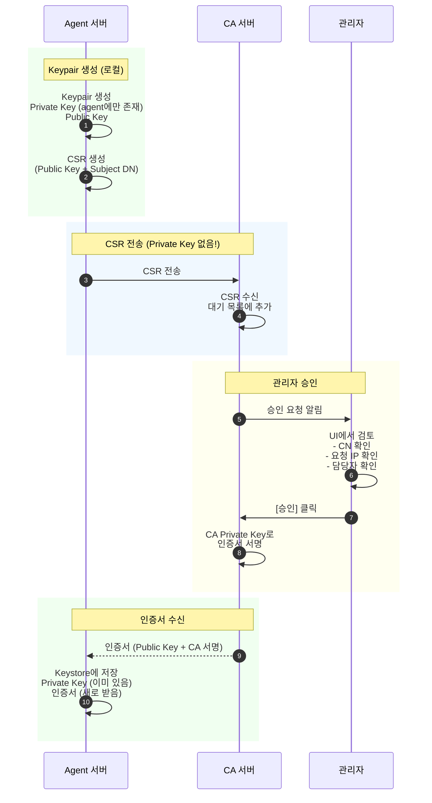
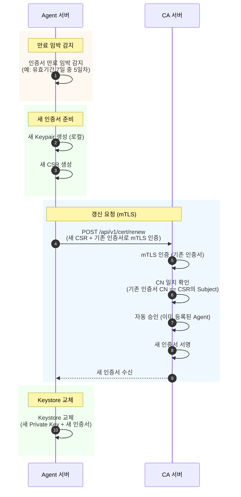

# mTLS 인증서 및 JWT 토큰 생성 흐름

이 문서는 mTLS 인증서에 포함된 정보와 인증서버에서 JWT 토큰 생성 시 이를 어떻게 참조하는지 설명합니다.

> **대상 독자**: 인증 서버(Auth Server) 및 CA 서버 개발팀
>
> **목적**: MwManger Agent가 사용하는 인증 체계의 정확한 spec 제공

---

## 시스템 구성 요약

```
┌─────────────────┐     ┌─────────────────┐     ┌─────────────────┐
│    CA Server    │     │   Auth Server   │     │   Biz Service   │
│  (인증서 발급)   │     │  (토큰 발급)     │     │  (업무 서비스)   │
└────────┬────────┘     └────────┬────────┘     └────────┬────────┘
         │                       │                       │
         │ 인증서 발급            │ 토큰 발급/검증         │ API 제공
         ▼                       ▼                       ▼
┌─────────────────────────────────────────────────────────────────┐
│                        MwManger Agent                           │
│  - mTLS 클라이언트 인증서로 Auth Server에 인증                    │
│  - JWT Access Token으로 Biz Service API 호출                     │
└─────────────────────────────────────────────────────────────────┘
```

### 각 서버의 역할

| 서버 | 역할 | 구현 필요 사항 |
|------|------|---------------|
| **CA Server** | Agent/Server 인증서 발급 및 관리 | PKI 인프라, 인증서 발급 API |
| **Auth Server** | mTLS 인증 후 JWT 토큰 발급 | OAuth2 엔드포인트, JWT 서명 |
| **Biz Service** | Agent에게 업무 API 제공 | JWT 토큰 검증, 비즈니스 로직 |

## 1. 인증서에 포함된 정보

### Agent 클라이언트 인증서 Subject DN 형식

```
CN={hostname}_{username}_J, OU=agent, O=Leebalso, C=KR
```

| 필드 | 값 | 용도 |
|------|-----|------|
| **CN** (Common Name) | `testserver01_appuser_J` | Agent ID (hostname + username 조합) |
| **OU** (Organizational Unit) | `agent` | 사용자 유형 식별 |
| **O** (Organization) | `Leebalso` | 조직명 |
| **C** (Country) | `KR` | 국가 코드 |

### 예시 인증서

| 인증서 파일 | CN 값 | Hostname | Username |
|------------|-------|----------|----------|
| `agent-test001.p12` | testserver01_appuser_J | testserver01 | appuser |
| `agent-test002.p12` | testserver02_svcuser_J | testserver02 | svcuser |
| `agent-test003.p12` | testserver03_testuser_J | testserver03 | testuser |

### 인증서 생성 스크립트

인증서는 `test-server/generate-certs.sh` 스크립트로 생성됩니다:

```bash
# Agent 클라이언트 인증서 생성 예시
openssl req -new -key agent.key \
    -subj "/C=KR/O=Leebalso/OU=agent/CN=testserver01_appuser_J" \
    -out agent.csr
```

---

## 2. 인증서버에서 DN 파싱

인증서버는 mTLS 연결 시 클라이언트 인증서의 Subject DN을 추출하여 파싱합니다.

**파일**: `test-server/mock_server.py:139-191`

```python
def parse_certificate_dn(cert_dn):
    """
    DN 형식: CN=hostname_username_J, OU=agent, O=Leebalso, C=KR
    """
    # DN에서 각 필드 추출
    cn_match = re.search(r'CN=([^,]+)', cert_dn)   # testserver01_appuser_J
    ou_match = re.search(r'OU=([^,]+)', cert_dn)   # agent
    o_match = re.search(r'O=([^,]+)', cert_dn)     # Leebalso
    c_match = re.search(r'C=([^,]+)', cert_dn)     # KR

    # CN을 파싱하여 hostname과 username 분리
    # 형식: {hostname}_{username}_J
    cn_match_detailed = re.match(r'^(.+)_(.+)_J$', cn)
    if cn_match_detailed:
        hostname = cn_match_detailed.group(1)  # testserver01
        username = cn_match_detailed.group(2)  # appuser

    return {
        "cn": cn,                    # 전체 CN 값
        "ou": ou,                    # usertype
        "o": organization,           # 조직
        "c": country,                # 국가
        "hostname": hostname,        # CN에서 파싱
        "username": username,        # CN에서 파싱
        "agent_id": cn,              # Agent 식별자
        "usertype": ou               # 사용자 유형
    }
```

---

## 3. Agent 검증 단계

인증서 정보를 파싱한 후, 4단계 검증을 수행합니다.

**파일**: `test-server/mock_server.py:194-235`

```python
def validate_agent_identity(cert_info, client_ip):
    """
    4단계 검증 프로세스
    """
    # 1단계: OU 검증 - usertype이 "agent"인지 확인
    if usertype != "agent":
        return False, "Invalid certificate usertype"

    # 2단계: 등록 확인 - Agent가 DB에 등록되어 있고 활성 상태인지 확인
    agent = AGENTS_DB.get(agent_id)
    if not agent or agent.get("status") != "active":
        return False, "Agent not registered or inactive"

    # 3단계: 정보 일치 확인 - 인증서의 hostname/username이 등록 정보와 일치하는지
    if cert_hostname != agent.get("hostname"):
        return False, "Certificate hostname mismatch"
    if cert_username != agent.get("username"):
        return False, "Certificate username mismatch"

    # 4단계: IP 검증 - 클라이언트 IP가 허용 목록에 있는지 (인증서 복사 방지)
    allowed_ips = agent.get("allowed_ips", [])
    if client_ip not in allowed_ips:
        return False, "Client IP not authorized"

    return True, None, agent
```

### 검증 실패 시나리오

| 검증 단계 | 실패 조건 | 에러 메시지 |
|----------|----------|------------|
| OU 검증 | OU가 "agent"가 아님 | Invalid certificate usertype |
| 등록 확인 | Agent가 미등록 또는 비활성 | Agent not registered or inactive |
| 정보 일치 | hostname/username 불일치 | Certificate hostname/username mismatch |
| IP 검증 | IP가 허용 목록에 없음 | Client IP not authorized |

---

## 4. JWT 토큰 생성

검증 성공 후, 인증서에서 추출한 정보를 기반으로 JWT 토큰을 생성합니다.

**파일**: `test-server/mock_server.py:80-106`

```python
def generate_access_token(agent_id, client_ip, scope, method):
    agent = AGENTS_DB.get(agent_id)

    payload = {
        # OAuth2 표준 클레임 (RFC 7519)
        "sub": agent_id,                    # Subject: 인증서 CN
        "iss": "leebalso-auth-server",      # Issuer: 발급자
        "aud": "https://api.mwagent.example.com",  # Audience: 대상
        "exp": datetime.utcnow() + timedelta(minutes=30),  # 만료 시간
        "iat": datetime.utcnow(),           # 발급 시간
        "scope": scope,                     # 권한 범위

        # 인증서에서 추출한 커스텀 클레임
        "usertype": agent.get("usertype", "agent"),  # OU에서 추출
        "hostname": agent.get("hostname", ""),       # CN 파싱
        "username": agent.get("username", ""),       # CN 파싱
        "client_ip": client_ip,             # 요청 시점 클라이언트 IP

        # 토큰 메타데이터
        "client_auth_method": method,       # 인증 방식
        "token_type": "access_token"        # 토큰 유형
    }

    return jwt.encode(payload, SECRET_KEY, algorithm="HS256")
```

### JWT 클레임 상세

| 클레임 | 타입 | 설명 | 예시 값 |
|--------|------|------|---------|
| `sub` | 표준 | Subject (Agent ID) | testserver01_appuser_J |
| `iss` | 표준 | Issuer (발급자) | leebalso-auth-server |
| `aud` | 표준 | Audience (대상) | https://api.mwagent.example.com |
| `exp` | 표준 | Expiration (만료 시간) | 1735123456 |
| `iat` | 표준 | Issued At (발급 시간) | 1735121656 |
| `scope` | 표준 | 권한 범위 | agent:commands agent:results |
| `usertype` | 커스텀 | 사용자 유형 (OU) | agent |
| `hostname` | 커스텀 | 호스트명 (CN 파싱) | testserver01 |
| `username` | 커스텀 | 사용자명 (CN 파싱) | appuser |
| `client_ip` | 커스텀 | 클라이언트 IP | 127.0.0.1 |
| `client_auth_method` | 커스텀 | 인증 방식 | client_credentials_mtls |
| `token_type` | 커스텀 | 토큰 유형 | access_token |

### 토큰 유효 기간

| 토큰 유형 | 유효 기간 |
|----------|----------|
| Access Token | 30분 |
| Refresh Token | 30일 |

---

## 5. 인증서 → JWT 매핑 요약

| 인증서 필드 | 추출 방법 | JWT 클레임 | 예시 값 |
|------------|----------|-----------|---------|
| CN 전체 | 직접 추출 | `sub` | testserver01_appuser_J |
| CN 첫 부분 | 정규식 파싱 | `hostname` | testserver01 |
| CN 두번째 부분 | 정규식 파싱 | `username` | appuser |
| OU | 직접 추출 | `usertype` | agent |
| 요청 IP | SSL 컨텍스트 | `client_ip` | 127.0.0.1 |

---

## 6. 전체 인증 흐름

```
┌─────────────────┐                    ┌─────────────────┐
│   Agent Client  │                    │   Auth Server   │
└────────┬────────┘                    └────────┬────────┘
         │                                      │
         │ 1. mTLS 연결 (인증서 전송)            │
         │  [CN=testserver01_appuser_J,        │
         │   OU=agent, O=Leebalso, C=KR]       │
         │─────────────────────────────────────>│
         │                                      │
         │ 2. POST /oauth2/token               │
         │    grant_type=client_credentials    │
         │─────────────────────────────────────>│
         │                                      │
         │                                      │ 3. DN 파싱
         │                                      │    - agent_id: testserver01_appuser_J
         │                                      │    - hostname: testserver01
         │                                      │    - username: appuser
         │                                      │    - usertype: agent
         │                                      │
         │                                      │ 4. 4단계 검증
         │                                      │    - OU 검증 ✓
         │                                      │    - 등록 확인 ✓
         │                                      │    - 정보 일치 ✓
         │                                      │    - IP 검증 ✓
         │                                      │
         │                                      │ 5. JWT 토큰 생성
         │                                      │    {
         │                                      │      "sub": "testserver01_appuser_J",
         │                                      │      "hostname": "testserver01",
         │                                      │      "username": "appuser",
         │                                      │      "usertype": "agent",
         │                                      │      "client_ip": "127.0.0.1",
         │                                      │      ...
         │                                      │    }
         │                                      │
         │ 6. Access Token 응답                 │
         │<─────────────────────────────────────│
         │  {                                   │
         │    "access_token": "eyJ...",        │
         │    "token_type": "Bearer",          │
         │    "expires_in": 1800,              │
         │    "scope": "agent:commands ..."    │
         │  }                                   │
         │                                      │
         │ 7. API 호출 시 토큰 사용             │
         │    Authorization: Bearer eyJ...     │
         │─────────────────────────────────────>│
```

---

## 7. 관련 파일

| 파일 | 설명 |
|------|------|
| `test-server/generate-certs.sh` | 인증서 생성 스크립트 |
| `test-server/mock_server.py` | 인증서버 (DN 파싱, JWT 생성) |
| `src/main/java/mwmanger/common/Common.java` | Java Agent mTLS 클라이언트 |
| `src/main/java/mwmanger/common/Config.java` | mTLS 설정 관리 |

---

## 8. 보안 고려사항

### 인증서 복사 방지 (IP 검증)

인증서가 복사되어 다른 서버에서 사용되는 것을 방지하기 위해, 각 Agent에 허용된 IP 목록을 관리합니다.

```python
AGENTS_DB = {
    "testserver01_appuser_J": {
        "allowed_ips": ["127.0.0.1", "10.0.1.100", "192.168.1.100"],
        ...
    }
}
```

### Cascading Token Renewal

Refresh Token이 만료된 경우 mTLS를 통한 자동 갱신을 지원합니다:

1. Refresh Token으로 갱신 시도
2. 401 응답 시 mTLS client_credentials grant로 폴백
3. 새로운 Access Token 발급

```java
public static int renewAccessTokenWithFallback() {
    int result = updateToken();  // refresh_token 시도

    if (result == -401 && config.isUseMtls()) {
        result = renewAccessTokenWithMtls();  // mTLS 폴백
    }

    return result;
}
```

---

## 9. Auth Server API Specification

### 필수 구현 엔드포인트

#### 9.1 Token Endpoint (OAuth2)

**URL**: `POST /oauth2/token`

**인증 방식**: mTLS (클라이언트 인증서 필수)

**Content-Type**: `application/x-www-form-urlencoded`

**Request Parameters**:

| 파라미터 | 필수 | 값 | 설명 |
|---------|------|-----|------|
| `grant_type` | Y | `client_credentials` | OAuth2 grant type |
| `scope` | N | `agent:commands agent:results` | 요청 권한 범위 |

**Request 예시**:
```http
POST /oauth2/token HTTP/1.1
Host: auth-server:8443
Content-Type: application/x-www-form-urlencoded
(mTLS 클라이언트 인증서: CN=testserver01_appuser_J)

grant_type=client_credentials&scope=agent:commands%20agent:results
```

**Success Response** (HTTP 200):
```json
{
    "access_token": "eyJhbGciOiJIUzI1NiIsInR5cCI6IkpXVCJ9...",
    "token_type": "Bearer",
    "expires_in": 1800,
    "scope": "agent:commands agent:results",
    "refresh_token": "dGVzdHNlcnZlcjAxX2FwcHVzZXJfSl9yZWZyZXNo..."
}
```

**Error Response** (HTTP 401/403):
```json
{
    "error": "invalid_client",
    "error_description": "Client certificate validation failed"
}
```

#### 9.2 Refresh Token Endpoint

**URL**: `POST /oauth2/token`

**인증 방식**: Bearer Token (refresh_token)

**Content-Type**: `application/x-www-form-urlencoded`

**Request Parameters**:

| 파라미터 | 필수 | 값 | 설명 |
|---------|------|-----|------|
| `grant_type` | Y | `refresh_token` | OAuth2 grant type |
| `refresh_token` | Y | (refresh token 값) | 이전에 발급받은 refresh token |

**Request 예시**:
```http
POST /oauth2/token HTTP/1.1
Host: auth-server:8443
Content-Type: application/x-www-form-urlencoded

grant_type=refresh_token&refresh_token=dGVzdHNlcnZlcjAxX2FwcHVzZXJfSl9yZWZyZXNo...
```

#### 9.3 Legacy Token Refresh (Non-mTLS)

**URL**: `POST /api/v1/security/refresh`

**인증 방식**: Bearer Token (refresh_token in header)

**Content-Type**: `application/json`

**Request Headers**:
```http
Authorization: Bearer {refresh_token}
```

**Request Body**:
```json
{
    "agent_id": "testserver01_appuser_J"
}
```

**Success Response** (HTTP 200):
```json
{
    "result_code": "OK",
    "access_token": "eyJhbGciOiJIUzI1NiIsInR5cCI6IkpXVCJ9...",
    "refresh_token": "dGVzdHNlcnZlcjAxX2FwcHVzZXJfSl9yZWZyZXNo..."
}
```

### JWT 토큰 요구사항

#### Access Token 필수 클레임

```json
{
    "sub": "testserver01_appuser_J",    // 필수: Agent ID (인증서 CN)
    "iss": "leebalso-auth-server",      // 필수: 발급자 식별자
    "aud": "https://api.mwagent.example.com",  // 필수: 대상 시스템
    "exp": 1735123456,                  // 필수: 만료 시간 (Unix timestamp)
    "iat": 1735121656,                  // 필수: 발급 시간
    "scope": "agent:commands agent:results",   // 필수: 권한 범위

    "usertype": "agent",                // 권장: 사용자 유형 (OU에서 추출)
    "hostname": "testserver01",         // 권장: 호스트명 (CN 파싱)
    "username": "appuser",              // 권장: 사용자명 (CN 파싱)
    "client_ip": "127.0.0.1"            // 권장: 인증 시점 클라이언트 IP
}
```

#### 토큰 서명 알고리즘

| 알고리즘 | 설명 | 권장 |
|---------|------|------|
| HS256 | HMAC + SHA256 (대칭키) | 개발/테스트용 |
| RS256 | RSA + SHA256 (비대칭키) | **운영 권장** |
| ES256 | ECDSA + SHA256 | 고보안 환경 |

### Error Codes

Agent가 처리하는 에러 코드:

| HTTP Status | error | 설명 | Agent 동작 |
|-------------|-------|------|-----------|
| 401 | `invalid_token` | 토큰 만료/무효 | mTLS로 재인증 시도 |
| 401 | `invalid_client` | 인증서 검증 실패 | 에러 로깅 후 종료 |
| 403 | `insufficient_scope` | 권한 부족 | 에러 로깅 |
| 403 | `ip_mismatch` | IP 검증 실패 | 에러 로깅 후 종료 |

---

## 10. CA Server Specification

### 인증서 발급 요구사항

#### Agent 클라이언트 인증서

| 항목 | 요구사항 |
|------|----------|
| **Subject DN 형식** | `CN={hostname}_{username}_J, OU=agent, O={조직명}, C={국가코드}` |
| **Key Usage** | Digital Signature, Key Encipherment |
| **Extended Key Usage** | Client Authentication (1.3.6.1.5.5.7.3.2) |
| **유효기간** | 1년 권장 (운영 정책에 따름) |
| **키 알고리즘** | RSA 2048bit 이상 또는 ECDSA P-256 |
| **파일 형식** | PKCS#12 (.p12) - 키+인증서 포함 |

#### 서버 인증서 (Auth Server, Biz Service)

| 항목 | 요구사항 |
|------|----------|
| **Subject DN 형식** | `CN={hostname}, OU={service|auth}, O={조직명}, C={국가코드}` |
| **SAN (Subject Alternative Name)** | DNS:{hostname}, IP:{ip_address} |
| **Key Usage** | Digital Signature, Key Encipherment |
| **Extended Key Usage** | Server Authentication (1.3.6.1.5.5.7.3.1) |

#### CA 인증서

| 항목 | 요구사항 |
|------|----------|
| **Subject DN 형식** | `CN={CA명}, OU=CA, O={조직명}, C={국가코드}` |
| **Key Usage** | Certificate Sign, CRL Sign |
| **Basic Constraints** | CA:TRUE |
| **유효기간** | 10년 이상 권장 |

### 인증서 배포

Agent에게 배포해야 하는 파일:

| 파일 | 용도 | 형식 |
|------|------|------|
| `agent-{id}.p12` | Agent 클라이언트 인증서+키 | PKCS#12 |
| `truststore.jks` | CA 인증서 (서버 검증용) | Java KeyStore |
| `ca.crt` | CA 인증서 (PEM) | PEM |

### Agent 설정 예시 (agent.properties)

```properties
# mTLS 활성화
use_mtls=true

# 클라이언트 인증서 (PKCS#12)
client.keystore.path=/opt/agent/certs/agent-testserver01.p12
client.keystore.password=changeit

# 서버 검증용 CA 인증서
truststore.path=/opt/agent/certs/truststore.jks
truststore.password=changeit
```

---

## 11. PKI 인증서 발급 흐름 (보안 원칙)

### 핵심 원칙: Private Key는 절대 전송하지 않음

PKI의 핵심 보안 원칙은 **Private Key가 생성된 곳을 떠나지 않는 것**입니다.

```
┌─────────────────────────────────────────────────────────────────────────────┐
│                         PKI 보안 원칙                                        │
├─────────────────────────────────────────────────────────────────────────────┤
│  ✅ 전송 가능: CSR (Certificate Signing Request) - Public Key 포함          │
│  ✅ 전송 가능: 서명된 인증서 - Public Key + CA 서명                          │
│  ❌ 전송 금지: Private Key - 절대로 네트워크를 통해 전송하지 않음            │
└─────────────────────────────────────────────────────────────────────────────┘
```

### CSR (Certificate Signing Request)의 구성

```
CSR에 포함되는 정보:
├── Public Key (공개키) ✅
├── Subject DN (CN, OU, O, C) ✅
├── 요청자 서명 (Private Key로 서명) ✅
│
CSR에 포함되지 않는 정보:
└── Private Key (개인키) ❌ - 절대 포함되지 않음
```

### 11.1 최초 인증서 발급 흐름 (수동 승인)



**핵심: Private Key는 Agent 서버를 떠나지 않음**

### 11.2 인증서 갱신 흐름 (자동)

인증서 만료 전 자동 갱신. 이미 승인된 Agent이므로 **mTLS 인증으로 자동 처리**.



### 11.3 관리자 승인 UI 예시

```
┌─────────────────────────────────────────────────────────────────────┐
│                    CA Server - 인증서 발급 요청                      │
├─────────────────────────────────────────────────────────────────────┤
│                                                                     │
│  ⏳ 대기 중인 요청 (2건)                                             │
│                                                                     │
│  ┌─────────────────────────────────────────────────────────────┐   │
│  │ 요청 #1                                              [신규]  │   │
│  ├─────────────────────────────────────────────────────────────┤   │
│  │ Subject: CN=prodserver01_appuser_J, OU=agent,               │   │
│  │          O=Leebalso, C=KR                                   │   │
│  │                                                             │   │
│  │ 요청 IP: 10.0.1.50                                          │   │
│  │ 요청 시각: 2025-12-05 10:30:00                              │   │
│  │ Public Key: RSA 2048bit                                     │   │
│  │                                                             │   │
│  │ [✓ 승인]  [✗ 거부]                                          │   │
│  └─────────────────────────────────────────────────────────────┘   │
│                                                                     │
│  ┌─────────────────────────────────────────────────────────────┐   │
│  │ 요청 #2                                              [신규]  │   │
│  ├─────────────────────────────────────────────────────────────┤   │
│  │ Subject: CN=prodserver02_svcuser_J, OU=agent,               │   │
│  │          O=Leebalso, C=KR                                   │   │
│  │                                                             │   │
│  │ 요청 IP: 10.0.1.51                                          │   │
│  │ 요청 시각: 2025-12-05 10:31:00                              │   │
│  │ Public Key: RSA 2048bit                                     │   │
│  │                                                             │   │
│  │ [✓ 승인]  [✗ 거부]                                          │   │
│  └─────────────────────────────────────────────────────────────┘   │
│                                                                     │
└─────────────────────────────────────────────────────────────────────┘
```

### 11.4 CA Server 인증서 발급 API

#### 최초 발급 요청 (수동 승인 필요)

**URL**: `POST /api/v1/cert/issue`

**인증 방식**: Bootstrap Token (1회용 등록 코드) 또는 Basic Auth

**Request**:
```json
{
    "csr": "-----BEGIN CERTIFICATE REQUEST-----\nMIIC...\n-----END CERTIFICATE REQUEST-----",
    "bootstrap_token": "abc123-xyz789"
}
```

**Response (승인 대기)**:
```json
{
    "status": "pending_approval",
    "request_id": "req-001",
    "message": "Certificate request submitted. Waiting for administrator approval."
}
```

**Response (승인 후)**:
```json
{
    "status": "approved",
    "certificate": "-----BEGIN CERTIFICATE-----\nMIID...\n-----END CERTIFICATE-----",
    "ca_certificate": "-----BEGIN CERTIFICATE-----\nMIIE...\n-----END CERTIFICATE-----",
    "expires_at": "2025-12-12T10:30:00Z"
}
```

#### 인증서 갱신 (자동 승인)

**URL**: `POST /api/v1/cert/renew`

**인증 방식**: mTLS (기존 유효한 인증서로 인증)

**Request**:
```json
{
    "csr": "-----BEGIN CERTIFICATE REQUEST-----\nMIIC...\n-----END CERTIFICATE REQUEST-----"
}
```

**Response**:
```json
{
    "status": "approved",
    "certificate": "-----BEGIN CERTIFICATE-----\nMIID...\n-----END CERTIFICATE-----",
    "ca_certificate": "-----BEGIN CERTIFICATE-----\nMIIE...\n-----END CERTIFICATE-----",
    "expires_at": "2025-12-19T10:30:00Z"
}
```

### 11.5 인증서 수명 정책 (권장)

| 환경 | 인증서 수명 | 갱신 시점 | 근거 |
|------|------------|----------|------|
| 개발/테스트 | 30일 | 만료 7일 전 | 빠른 테스트 주기 |
| 운영 (일반) | 90일 | 만료 14일 전 | 탈취 시 피해 제한 |
| 운영 (고보안) | 7일 | 만료 2일 전 | 최소 노출 시간 |

**짧은 수명의 장점**:
- 인증서 탈취 시 피해 기간 최소화
- 자동 갱신으로 운영 부담 없음
- 새 Keypair 생성으로 기존 인증서 무효화

### 11.6 보안 체크리스트

#### Agent 측
- [ ] Private Key는 Agent 서버에서만 생성
- [ ] Private Key는 네트워크로 전송하지 않음
- [ ] Keystore 파일 권한 제한 (600 또는 400)
- [ ] 인증서 만료 전 자동 갱신 구현
- [ ] 갱신 시 새 Keypair 생성 (기존 키 재사용 금지)

#### CA Server 측
- [ ] 최초 발급은 관리자 승인 필수
- [ ] 갱신은 mTLS 인증으로 자동 승인
- [ ] 갱신 시 CN 일치 여부 검증
- [ ] 인증서 발급 이력 로깅
- [ ] CRL(Certificate Revocation List) 또는 OCSP 지원

---

## 12. Agent 시작 시 인증서 검증 흐름

Agent는 시작 시 인증서 상태를 확인하고 적절한 조치를 취합니다.

### 12.1 시작 흐름도

```
                            Agent 시작
                                │
                                ▼
                    ┌───────────────────────┐
                    │ 1. agent.p12 존재?     │
                    └───────────┬───────────┘
                                │
                ┌───────────────┴───────────────┐
                │ No                            │ Yes
                ▼                               ▼
        ┌───────────────────┐       ┌───────────────────────┐
        │ 2. bootstrap.token │       │ 3. 인증서 유효기간 확인 │
        │    파일 존재?      │       └───────────┬───────────┘
        └─────────┬─────────┘                   │
                  │                 ┌───────────┼───────────┬───────────┐
           ┌──────┴──────┐          │           │           │           │
           │ No          │ Yes      ▼           ▼           ▼           ▼
           ▼             ▼       만료됨       임박        유효      파싱 실패
     ┌──────────┐  ┌───────────┐ (expired)  (< 7일 남음)  (>= 7일)      │
     │ 에러 종료 │  │ Token 읽기 │    │           │           │           │
     │          │  └─────┬─────┘    │           │           │           ▼
     │ "token   │        │          │           │           │      최초 등록으로
     │  없음"   │        ▼          │           │           │           │
     └──────────┘  ┌───────────┐    │           │           │           │
                   │ Keypair   │    │           │           │           │
                   │ CSR 생성  │◄───┴───────────│───────────│───────────┘
                   └─────┬─────┘                │           │
                         │                      │           │
                         ▼                      ▼           ▼
                   ┌───────────┐          ┌──────────┐ ┌─────────┐
                   │ POST      │          │ 갱신 요청 │ │ 정상    │
                   │ /issue    │          │ POST     │ │ 시작    │
                   │ (Token)   │          │ /renew   │ └────┬────┘
                   └─────┬─────┘          │ (mTLS)   │      │
                         │                └────┬─────┘      │
                         ▼                     │            │
                   ┌───────────┐               ▼            │
                   │ 승인 대기  │         ┌───────────┐      │
                   │ (polling) │         │ 새 인증서  │      │
                   └─────┬─────┘         │ 저장       │      │
                         │               └─────┬─────┘      │
                         ▼                     │            │
                   ┌───────────┐               │            │
                   │ 승인 완료? │               │            │
                   └─────┬─────┘               │            │
                         │                     │            │
                  ┌──────┴──────┐              │            │
                  │ Yes         │ No           │            │
                  ▼             ▼              │            │
            ┌──────────┐  ┌──────────┐         │            │
            │ 인증서    │  │ 대기     │         │            │
            │ 저장      │  │ (재시도) │         │            │
            └────┬─────┘  └──────────┘         │            │
                 │                             │            │
                 ▼                             │            │
            ┌──────────────┐                   │            │
            │ bootstrap.   │                   │            │
            │ token 삭제   │                   │            │
            └──────┬───────┘                   │            │
                   │                           │            │
                   ▼                           │            │
            ┌──────────┐                       │            │
            │ 정상 시작 │◄──────────────────────┴────────────┘
            └──────────┘
```

### 12.2 인증서 상태 판단 기준

| 상태 | 조건 | 처리 | API |
|------|------|------|-----|
| **없음** | Keystore 파일 없음 | 최초 등록 | `POST /api/v1/cert/issue` |
| **파싱 실패** | 파일 손상/비밀번호 오류 | 최초 등록 | `POST /api/v1/cert/issue` |
| **만료됨** | `현재시간 > 만료시간` | 최초 등록 (mTLS 불가) | `POST /api/v1/cert/issue` |
| **임박** | `만료시간 - 현재시간 < 갱신임계값` | 갱신 후 시작 | `POST /api/v1/cert/renew` |
| **유효** | `만료시간 - 현재시간 >= 갱신임계값` | 정상 시작 | - |

### 12.3 인증서 디렉토리 구조

Agent는 인증서 관련 파일을 지정된 디렉토리에서 관리합니다.

```
{cert_dir}/                      # 기본값: ./certs/
├── bootstrap.token              # 최초 등록용 토큰 (사용 후 자동 삭제)
├── agent.p12                    # 클라이언트 인증서 + Private Key (PKCS#12)
└── truststore.jks               # CA 인증서 (서버 검증용)
```

**파일별 역할:**

| 파일 | 용도 | 생성 시점 | 삭제 시점 |
|------|------|----------|----------|
| `bootstrap.token` | 최초 등록 시 CA Server 인증 | 관리자가 사전 배포 | 인증서 발급 완료 후 자동 삭제 |
| `agent.p12` | mTLS 클라이언트 인증 | 인증서 발급/갱신 시 | - |
| `truststore.jks` | CA 인증서 (서버 검증) | 관리자가 사전 배포 | - |

**Bootstrap Token 파일 형식:**

```
# bootstrap.token (단순 텍스트 파일)
bt-abc123-xyz789-def456
```

또는 JSON 형식:

```json
{
    "token": "bt-abc123-xyz789-def456",
    "ca_server_url": "https://ca-server:8443",
    "expected_cn": "prodserver01_appuser_J"
}
```

### 12.4 설정 파라미터

```properties
# agent.properties

# CA Server URL
ca.server.url=https://ca-server:8443

# 인증서 디렉토리 (bootstrap.token, agent.p12, truststore.jks 위치)
cert.dir=./certs

# Bootstrap Token 파일명
cert.bootstrap.token.file=bootstrap.token

# 인증서 갱신 임계값 (일)
# 만료까지 남은 기간이 이 값보다 작으면 갱신 시도
cert.renewal.threshold.days=7

# 최초 등록 시 승인 대기 polling 간격 (초)
cert.issue.polling.interval.seconds=30

# 최초 등록 시 최대 대기 시간 (분)
cert.issue.max.wait.minutes=60
```

### 12.5 Java 구현 의사코드

```java
public class CertificateManager {

    private final String certDir;
    private final String keystorePath;
    private final String bootstrapTokenPath;

    public CertificateManager(Config config) {
        this.certDir = config.getCertDir();  // ./certs
        this.keystorePath = certDir + "/agent.p12";
        this.bootstrapTokenPath = certDir + "/" + config.getBootstrapTokenFile();
    }

    public CertificateStatus checkAndRenewCertificate() {

        // 1. Keystore 파일 존재 확인
        File keystoreFile = new File(keystorePath);
        if (!keystoreFile.exists()) {
            return requestNewCertificate();  // 최초 등록
        }

        // 2. 인증서 로드 및 유효기간 확인
        X509Certificate cert;
        try {
            cert = loadCertificateFromKeystore();
        } catch (Exception e) {
            logger.error("Failed to load certificate: " + e.getMessage());
            return requestNewCertificate();  // 파싱 실패 → 최초 등록
        }

        // 3. 만료 여부 확인
        Date now = new Date();
        Date expiry = cert.getNotAfter();
        long daysUntilExpiry = TimeUnit.MILLISECONDS.toDays(
            expiry.getTime() - now.getTime()
        );

        if (daysUntilExpiry <= 0) {
            // 만료됨 → mTLS 불가 → 최초 등록
            logger.warn("Certificate expired. Requesting new certificate.");
            return requestNewCertificate();
        }

        if (daysUntilExpiry < config.getCertRenewalThresholdDays()) {
            // 임박 → mTLS로 갱신
            logger.info("Certificate expiring in " + daysUntilExpiry + " days. Renewing.");
            return renewCertificate();
        }

        // 4. 유효 → 정상 시작
        logger.info("Certificate valid for " + daysUntilExpiry + " days.");
        return CertificateStatus.VALID;
    }

    private CertificateStatus requestNewCertificate() {
        // 1. Bootstrap Token 파일 확인
        File tokenFile = new File(bootstrapTokenPath);
        if (!tokenFile.exists()) {
            logger.error("No certificate and no bootstrap token found.");
            logger.error("Please place bootstrap.token file in: " + certDir);
            return CertificateStatus.NO_BOOTSTRAP_TOKEN;
        }

        // 2. Bootstrap Token 읽기
        String bootstrapToken = readBootstrapToken(tokenFile);
        if (bootstrapToken == null || bootstrapToken.isEmpty()) {
            logger.error("Bootstrap token file is empty or invalid.");
            return CertificateStatus.INVALID_BOOTSTRAP_TOKEN;
        }

        // 3. 새 Keypair 생성
        KeyPair keyPair = generateKeyPair();

        // 4. CSR 생성
        String csr = generateCSR(keyPair, config.getAgentId());

        // 5. CA Server에 요청 (Bootstrap Token 사용)
        CertResponse response = httpPost(
            config.getCaServerUrl() + "/api/v1/cert/issue",
            Map.of(
                "csr", csr,
                "bootstrap_token", bootstrapToken
            )
        );

        // 6. 승인 대기
        if ("pending_approval".equals(response.getStatus())) {
            return waitForApproval(response.getRequestId(), keyPair, tokenFile);
        }

        // 7. 즉시 승인된 경우
        CertificateStatus status = saveCertificate(keyPair, response.getCertificate());
        if (status == CertificateStatus.VALID) {
            deleteBootstrapToken(tokenFile);  // 사용 완료 후 삭제
        }
        return status;
    }

    private String readBootstrapToken(File tokenFile) {
        try {
            String content = new String(Files.readAllBytes(tokenFile.toPath())).trim();

            // JSON 형식 지원
            if (content.startsWith("{")) {
                JSONObject json = new JSONObject(content);
                return json.getString("token");
            }

            // 단순 텍스트 형식
            return content;
        } catch (Exception e) {
            logger.error("Failed to read bootstrap token: " + e.getMessage());
            return null;
        }
    }

    private void deleteBootstrapToken(File tokenFile) {
        try {
            if (tokenFile.delete()) {
                logger.info("Bootstrap token file deleted after successful registration.");
            } else {
                logger.warn("Failed to delete bootstrap token file. Please delete manually: " + tokenFile.getPath());
            }
        } catch (Exception e) {
            logger.warn("Failed to delete bootstrap token file: " + e.getMessage());
        }
    }

    private CertificateStatus renewCertificate() {
        // 1. 새 Keypair 생성
        KeyPair keyPair = generateKeyPair();

        // 2. CSR 생성
        String csr = generateCSR(keyPair, config.getAgentId());

        // 3. CA Server에 요청 (mTLS 인증)
        CertResponse response = httpPostWithMtls(
            config.getCaServerUrl() + "/api/v1/cert/renew",
            Map.of("csr", csr)
        );

        // 4. 자동 승인되므로 바로 저장
        return saveCertificate(keyPair, response.getCertificate());
    }

    private CertificateStatus waitForApproval(String requestId, KeyPair keyPair, File tokenFile) {
        long startTime = System.currentTimeMillis();
        long maxWaitMs = config.getCertIssueMaxWaitMinutes() * 60 * 1000;

        while (System.currentTimeMillis() - startTime < maxWaitMs) {
            // 승인 상태 확인
            CertResponse response = httpGet(
                config.getCaServerUrl() + "/api/v1/cert/status/" + requestId
            );

            if ("approved".equals(response.getStatus())) {
                CertificateStatus status = saveCertificate(keyPair, response.getCertificate());
                if (status == CertificateStatus.VALID) {
                    deleteBootstrapToken(tokenFile);  // 사용 완료 후 삭제
                }
                return status;
            }

            if ("rejected".equals(response.getStatus())) {
                logger.error("Certificate request rejected.");
                return CertificateStatus.REJECTED;
            }

            // 대기
            Thread.sleep(config.getCertIssuePollingIntervalSeconds() * 1000);
        }

        logger.error("Certificate approval timeout.");
        return CertificateStatus.TIMEOUT;
    }
}
```

### 12.6 상태 전이 다이어그램

```
                    ┌─────────────────┐
                    │                 │
                    ▼                 │ (만료됨)
┌─────────┐    ┌─────────┐    ┌─────────────┐
│  없음   │───▶│ 승인대기 │───▶│    유효     │
└─────────┘    └─────────┘    └─────────────┘
                    │                 │
                    │ (거부됨)        │ (임박)
                    ▼                 ▼
              ┌─────────┐      ┌─────────────┐
              │  실패   │      │  갱신 중    │
              └─────────┘      └──────┬──────┘
                                      │
                                      ▼
                               ┌─────────────┐
                               │    유효     │
                               └─────────────┘
```

### 12.7 에러 처리

| 상황 | 처리 |
|------|------|
| CA Server 연결 실패 | 재시도 (exponential backoff) 후 실패 시 종료 |
| Bootstrap Token 없음 | 에러 로그 후 종료 (관리자가 token 파일 배포 필요) |
| Bootstrap Token 무효 | 에러 로그 후 종료 (CA Server에서 거부) |
| 승인 대기 타임아웃 | 로그 남기고 종료, 관리자 확인 필요 알림 |
| 승인 거부 | 로그 남기고 종료 |
| 갱신 실패 (mTLS 오류) | 최초 등록으로 fallback |
| Keystore 저장 실패 | 로그 남기고 종료 |

### 12.8 로그 메시지 예시

```
# 정상 시작
INFO  [CertificateManager] Certificate valid for 45 days. Starting agent.

# 갱신 필요
INFO  [CertificateManager] Certificate expiring in 5 days. Initiating renewal.
INFO  [CertificateManager] Generated new keypair (RSA 2048)
INFO  [CertificateManager] Sending CSR to CA server (mTLS)
INFO  [CertificateManager] Certificate renewed successfully. Valid until 2025-12-19.

# 최초 등록
INFO  [CertificateManager] No certificate found. Initiating registration.
INFO  [CertificateManager] Found bootstrap token file: ./certs/bootstrap.token
INFO  [CertificateManager] Generated new keypair (RSA 2048)
INFO  [CertificateManager] Sending CSR to CA server
INFO  [CertificateManager] Certificate request submitted. Waiting for approval...
INFO  [CertificateManager] Approval pending. Polling in 30 seconds...
INFO  [CertificateManager] Certificate approved. Saving to keystore.
INFO  [CertificateManager] Bootstrap token file deleted after successful registration.
INFO  [CertificateManager] Registration complete. Starting agent.

# Bootstrap Token 없음
ERROR [CertificateManager] No certificate and no bootstrap token found.
ERROR [CertificateManager] Please place bootstrap.token file in: ./certs

# 실패
ERROR [CertificateManager] Certificate request rejected by administrator.
ERROR [CertificateManager] CA server connection failed: Connection refused
ERROR [CertificateManager] Approval timeout (60 minutes). Please contact administrator.
```
